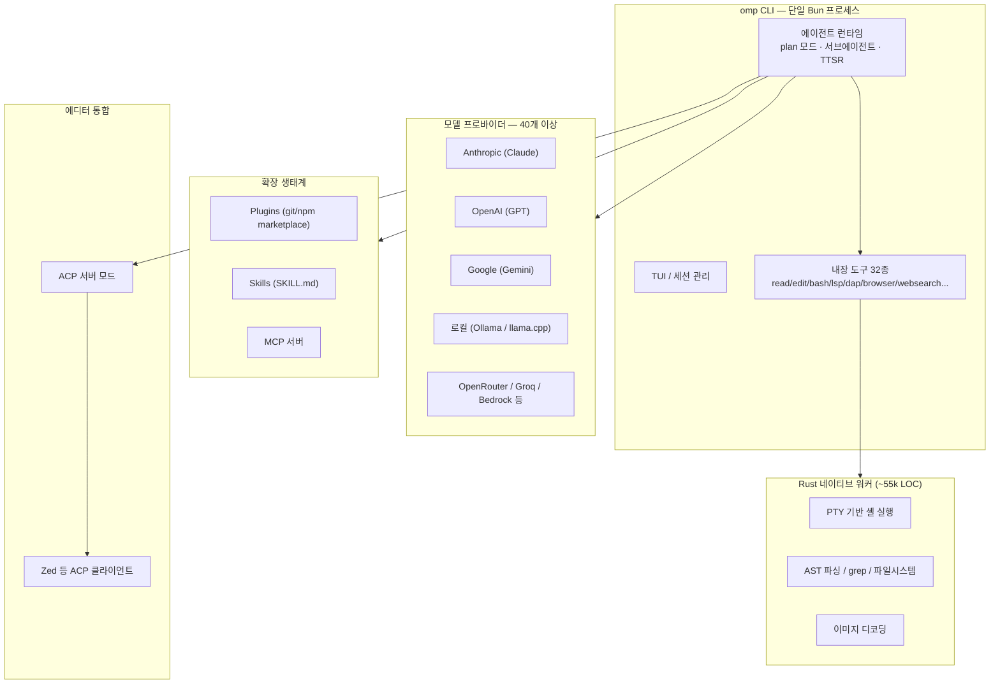

# Oh My Pi(omp) 가이드

> [!question] 질문
> 터미널에서 `omp`를 치면 "oh-my-pi"가 뜬다. 이게 Claude를 감싸는 래퍼 도구일 뿐인지, 정체가 뭔지, 어떻게 활용해야 하는지 알고 싶다.

## TL;DR

omp는 터미널에서 도는 AI 코딩 에이전트 CLI입니다. Anthropic Claude, OpenAI GPT, Google Gemini, 로컬 모델(Ollama 등) 등 40개 이상의 모델 프로바이더 중 아무거나 골라 백엔드로 붙일 수 있고, LSP/DAP 실제 구동, 해시라인 편집, 서브에이전트, ACP 에디터 통합 등 자체 도구 생태계를 갖춘 독립 오픈소스 프로젝트입니다.

이 환경에 설치된 버전은 `omp v16.4.6`(Bun 전역 설치, `C:\Users\HOME\.bun\bin\omp.exe`)이고, `D:\AI`에서 실행해 본 세션 기록도 남아 있었습니다.

## 1. 정체

| 항목 | 내용 |
|---|---|
| 이름 | Oh My Pi, 바이너리 명령어는 `omp` |
| 원조 | Mario Zechner의 "Pi" 프로젝트를 Can Bölük이 포크 |
| 라이선스 | MIT (2025 Mario Zechner, 2025-2026 Can Bölük) |
| 패키지 | `@oh-my-pi/pi-coding-agent` (bun/npm) |
| 언어 스택 | TypeScript 87.5%(CLI·TUI·에이전트 런타임) + Rust 약 5.5만 줄(셸·grep·AST·PTY·이미지 디코딩) + Python 일부(선택 모듈) |
| 설치 | `curl -fsSL https://omp.sh/install \| sh`, `brew install can1357/tap/omp`, 또는 `bun install -g @oh-my-pi/pi-coding-agent` |
| 홈페이지 | https://omp.sh/ — 캐치프레이즈는 "a coding agent with the IDE wired in" |

## 2. 아키텍처



(omp의 TUI 자체가 `tui.renderMermaid = true` 설정으로 mermaid 다이어그램을 렌더링합니다.)

## 3. Claude Code / OpenCode와 비교

| 항목 | Claude Code (`claude`) | omp (Oh My Pi) | OpenCode (`opencode`) |
|---|---|---|---|
| 정체 | Anthropic 공식 코딩 에이전트 CLI | 독립 오픈소스 코딩 에이전트 CLI | 독립 오픈소스 코딩 에이전트 CLI |
| 모델 백엔드 | Anthropic 모델 전용 | 40+ 프로바이더 자유 선택 | 75+ 프로바이더 자유 선택(+GitHub Copilot/ChatGPT 계정 연동) |
| 실행 형태 | 독자 바이너리 `claude` | 독자 바이너리 `omp` (Bun+Rust) | 클라이언트-서버 구조, 서버는 TS(Bun), TUI는 OpenTUI(TS+Zig) |
| Claude 없이 동작 | 불가 | 가능(GPT/Gemini/로컬만으로도 완결) | 가능(GPT/Gemini/로컬/Copilot·ChatGPT 계정만으로도 완결) |
| 확장 체계 | MCP, 훅, 서브에이전트 | MCP + Plugins + Skills + Extensions + Marketplace | MCP + GitHub 에이전트 연동 |
| 에디터 통합 | 자체 확장 | ACP 프로토콜로 Zed 등과 연결 | ACP 프로토콜로 Zed 등과 연결 |

## 4. 핵심 차별 기능

### 해시라인 편집(Hashline Edits)
파일 편집 위치를 줄 번호나 문자열 매칭이 아니라 **콘텐츠 해시 앵커**로 지정합니다. 다른 에이전트가 흔히 겪는 "patch가 stale해져 파일을 깨뜨리는" 문제를 막아줍니다 — 앵커가 어긋나면 아예 패치를 거부합니다. 공식 소개에서는 이 방식으로 토큰 사용량을 약 61% 절감한다고 밝힙니다.

### 실제 LSP / DAP 통합
언어 서버(LSP)로 진단·심볼 탐색·rename·참조 찾기를 수행하고, 디버거 프로토콜(DAP)로 `lldb`, `dlv`, `debugpy` 등을 직접 구동합니다.

### 서브에이전트 = 격리 워크트리 + 구조화 반환
서브에이전트가 별도 git worktree에서 실행되고, 텍스트 요약이 아니라 **스키마 검증된 객체**를 반환합니다. `omp worktree` 명령으로 이렇게 생성된 워크트리들을 조회·정리할 수 있습니다.

### 영속 Python/JS 실행 커널
한 번 띄운 Python/JavaScript 세션이 도구 호출 사이에도 상태를 유지합니다.

### Hindsight 메모리 / TTSR
- Hindsight 메모리는 프로젝트 관련 사실을 세션 간에 유지합니다.
- TTSR(Time-Traveling Stream Rules)은 모델이 스트리밍 출력 중 특정 패턴을 낼 때 개입·중단·재지시하는 규칙 엔진입니다.

### ACP(Agent Client Protocol) 서버 모드
`omp acp`로 실행하면 omp가 JSON-RPC 기반 ACP 서버가 되어 Zed 같은 에디터에 "붙는" 에이전트로 동작합니다.

### 프로필 / 계정 밸런싱 / auth-broker
- `--profile <name>`으로 인증·세션·설정·캐시가 완전히 분리된 프로필을 만들 수 있습니다.
- `omp usage`로 인증된 모든 프로바이더 계정의 사용량·한도를 한 번에 볼 수 있습니다.
- `omp dry-balance`는 여러 OAuth 계정 사이에서 요청을 랜덤 분산하는 드라이런입니다.
- `auth-broker`는 헤드리스/원격 환경에서 자격증명을 중앙 관리하는 백엔드입니다.

### 역할 기반 모델 라우팅
`--model`(기본), `--smol`(가벼운 작업용), `--slow`(깊은 추론용), `--plan`(설계용) 플래그와 `PI_SMOL_MODEL` / `PI_SLOW_MODEL` / `PI_PLAN_MODEL` 환경변수로 작업 성격에 따라 다른 모델을 자동으로 골라 쓰게 설정할 수 있습니다.

### 기존 도구 설정 자동 흡수
처음 실행할 때 `.claude`, `.cursor`, `.windsurf`, `.gemini`, `.codex`, `.cline`, `.github/copilot`, `.vscode` 등 이미 디스크에 있는 다른 도구의 규칙·스킬·MCP 서버 설정을 그대로 읽어들입니다.

## 5. 실전 사용 예시

```bash
omp                                          # 대화형 모드
omp "src 아래 .ts 파일 전부 나열해줘"           # 초기 프롬프트
omp @prompt.md @image.png "하늘이 무슨 색이야?" # 파일 첨부
omp -p "src 아래 .ts 파일 전부 나열해줘"        # 비대화형 모드
omp --continue "아까 뭐 얘기했지?"             # 세션 이어가기
omp --resume                                  # 세션 피커
omp --model opus "이 코드 리팩터링 도와줘"      # 모델 지정
omp --profile work --alias omp-work           # 격리 프로필 + 단축 명령
omp usage                                     # 사용량 확인
omp usage --provider anthropic
omp plugin install github:user/repo           # 플러그인 설치
omp plugin list
omp acp                                       # ACP 서버로 실행(Zed 연동)
omp --export ~/.omp/agent/sessions/--path--/session.jsonl
```

## 6. 이 환경에서 확인된 로컬 상태

- `~/.omp/agent/config.yml` 주요 값: `files.edit.mode = hashline`, `context.compaction.strategy = snapcompact`, `context.ttsr.enabled = true`, `appearance.tui.renderMermaid = true`
- `~/.omp/agent/sessions/--D--AI--` 디렉터리가 이미 존재 — `D:\AI`에서 omp를 실행해 본 세션 기록이 남아 있음
- `agent.db`, `history.db`, `models.db` 등 SQLite 기반 상태 저장소가 `~/.omp/agent/`에 있음

## 7. 언제 omp를, 언제 Claude Code를 쓸까

- **omp가 유리한 경우**: Claude 외에 GPT-5.2·Gemini·로컬 모델도 같은 워크플로에서 섞어 쓰고 싶을 때, 실제 디버거(DAP)를 에이전트가 직접 조작해야 할 때, Zed 등 ACP 지원 에디터에 에이전트를 물리고 싶을 때, 여러 계정으로 레이트리밋을 분산하고 싶을 때.
- **Claude Code가 유리한 경우**: Anthropic 모델 하나로 충분하고, 이미 그 위에 쌓은 스킬·에이전트 워크플로를 그대로 쓰고 싶을 때.

두 도구는 세션·메모리·설정 저장소가 서로 완전히 분리되어 있어(`~/.omp` vs `~/.claude`), 같은 프로젝트 디렉터리를 오가며 병행 사용해도 한쪽에서 쌓은 컨텍스트가 다른 쪽으로 자동 이어지지는 않습니다.

## 참고 자료

- [omp — a coding agent with the IDE wired in](https://omp.sh/)
- [GitHub: can1357/oh-my-pi](https://github.com/can1357/oh-my-pi)
- [Oh My Pi Deep Dive — agentpedia.codes](https://agentpedia.codes/blog/oh-my-pi-terminal-coding-agent-guide)
- [omp docs: skills](https://omp.sh/docs/skills)
- [omp docs: plugins](https://omp.sh/docs/plugins)
- [omp docs: ACP](https://omp.sh/docs/acp)
- [omp docs: providers](https://omp.sh/docs/providers)
- [Zed — Agent Client Protocol](https://zed.dev/acp)
- 로컬 확인: `omp --help`, `omp models --help`, `omp config list`, `~/.omp/agent/config.yml`
