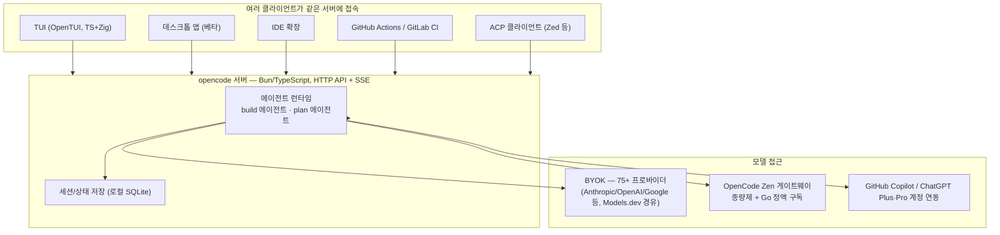

# OpenCode 가이드

> [!question] 질문
> omp와 비교하려고 "opencode go"를 조사했는데, 알고 보니 그건 OpenCode Zen 안의 월 구독 플랜 이름이었다. 실제로 궁금했던 건 OpenCode(터미널 코딩 에이전트) 자체였다.

## TL;DR

OpenCode는 터미널에서 도는 오픈소스 AI 코딩 에이전트입니다(`opencode.ai`, GitHub `sst/opencode`). Claude Code나 omp와 같은 자리, 즉 "코딩 에이전트 본체"이고, 75개 이상의 LLM 프로바이더를 자유롭게 붙일 수 있습니다. 서버(TypeScript/Bun)와 클라이언트(TUI·데스크톱·IDE 확장 등)가 분리된 **클라이언트-서버 구조**가 가장 큰 특징입니다.

이 환경에는 `opencode` v1.1.36이 npm으로 설치되어 있고(`C:\Users\HOME\AppData\Roaming\npm\opencode.cmd`), 사용 이력도 남아 있습니다.

## 1. 정체

| 항목 | 내용 |
|---|---|
| 이름 | OpenCode, 바이너리 명령어는 `opencode` |
| 저장소 | GitHub `sst/opencode`, 약 18.5만 스타 |
| 라이선스 | MIT |
| 언어 스택 | 서버·에이전트 로직: TypeScript(Bun 런타임) / TUI: v1.0부터 자체 개발한 OpenTUI(TypeScript + Zig 바인딩)로 교체 — 그 이전에는 Go의 Bubble Tea 프레임워크로 만든 TUI를 썼음 |
| 설치 | `curl -fsSL https://opencode.ai/install \| bash`, npm/Homebrew/Scoop/Arch Linux/Nix 등도 지원 |
| 홈페이지 | https://opencode.ai/ |

## 2. 아키텍처 — 클라이언트-서버 구조

OpenCode는 에이전트 로직을 담당하는 **서버**와, 그 서버에 붙는 여러 **클라이언트**를 분리한 구조입니다. 서버는 HTTP API와 SSE(Server-Sent Events)로 실시간 업데이트를 밀어주고, 세션 상태는 로컬 SQLite에 저장합니다.



## 3. 핵심 기능

### 두 개의 기본 에이전트
- `build`: 파일 수정·명령 실행까지 가능한 풀 액세스 개발 에이전트
- `plan`: 읽기 전용, 코드 분석·탐색 전용 에이전트
- TUI에서 Tab 키로 즉시 전환

### LSP 자동 로드
프로젝트 언어에 맞는 LSP 서버를 자동으로 붙여 진단·심볼 탐색을 지원합니다.

### MCP 서버 관리
`opencode mcp add/list/auth/logout/debug`로 MCP 서버를 등록·관리하고, OAuth 인증이 필요한 MCP 서버도 지원합니다.

### GitHub 에이전트 / PR 자동화
`opencode github install`로 저장소에 GitHub 에이전트를 설치하면 이슈·PR 코멘트로 에이전트를 트리거할 수 있고, `opencode pr <number>`로 특정 PR 브랜치를 체크아웃해 바로 작업을 이어갈 수 있습니다.

### 세션 공유 / 다중 클라이언트
서버-클라이언트 구조 덕분에 같은 세션을 터미널, 데스크톱 앱, IDE에서 이어서 볼 수 있고, `opencode serve`/`opencode web`으로 헤드리스 서버나 웹 UI로도 띄울 수 있습니다.

### ACP(Agent Client Protocol) 서버 모드
`opencode acp`로 실행하면 Zed 같은 ACP 지원 에디터에 에이전트로 붙일 수 있습니다(omp의 ACP 모드와 같은 프로토콜).

### 계정 연동
API 키 없이도 GitHub Copilot 구독이나 ChatGPT Plus/Pro 계정으로 로그인해 모델에 접근할 수 있습니다(`opencode auth login`).

### OpenCode Zen — 모델 게이트웨이 (선택 사항)
자체 API 키(BYOK) 대신 OpenCode가 검증한 모델 목록에 종량제로 접근하는 게이트웨이입니다. 그 안에 **"Go"**라는 월 $10 정액 구독 플랜이 있어 GLM·Kimi·DeepSeek·Qwen·MiniMax 등 오픈소스 계열 모델 13종을 한도 내에서 자유롭게 쓸 수 있습니다. 완전히 선택 사항이며, 안 써도 OpenCode 사용에 지장이 없습니다.

## 4. 실전 사용 예시

```bash
opencode                                       # 대화형 TUI (현재 디렉터리)
opencode ~/projects/foo                        # 특정 프로젝트 경로에서 시작
opencode run "src 아래 실패하는 테스트 찾아줘"   # 메시지 하나 던지고 실행
opencode --continue                             # 이전 세션 이어가기
opencode --session <id>
opencode --model anthropic/claude-opus-4-6      # 모델 지정
opencode auth login                             # 프로바이더 로그인
opencode auth list
opencode mcp add                                # MCP 서버 등록
opencode mcp list
opencode agent list                             # 에이전트 목록/생성
opencode agent create
opencode github install                         # GitHub 에이전트 설치
opencode pr 123                                 # PR 체크아웃
opencode serve                                  # 헤드리스 서버
opencode web                                    # 웹 UI
opencode acp                                    # ACP 서버(Zed 연동)
opencode export <sessionID>
opencode import <file>
opencode stats
```

## 5. 이 환경에서 확인된 로컬 상태

- `opencode` v1.1.36이 npm 전역 설치되어 있음
- `~/.local/share/opencode/`에 `auth.json`, `bin/`, `log/`, `storage/`, `tool-output/`이 있어 실제 사용 이력이 있음
- `~/.config/opencode/`에 `opencode.json`, `package.json`, `bun.lock`, `node_modules/`가 있음
- 로컬 `opencode models` 목록에서 `opencode/big-pickle`, `opencode/gpt-5-nano`, `google/gemini-*` 등이 확인됨(Zen 종량제 쪽 모델)

## 참고 자료

- [OpenCode — 공식 홈페이지](https://opencode.ai/)
- [GitHub: sst/opencode](https://github.com/sst/opencode)
- [DeepWiki: sst/opencode](https://deepwiki.com/sst/opencode)
- [DeepWiki: TUI Application Bootstrap](https://deepwiki.com/sst/opencode/6.3-tui-application-bootstrap)
- [OpenCode Docs: Zen](https://opencode.ai/docs/zen/)
- 로컬 확인: `opencode --version`, `opencode --help`, `opencode agent/auth/github/mcp --help`, `opencode models`, `~/.local/share/opencode`, `~/.config/opencode`
