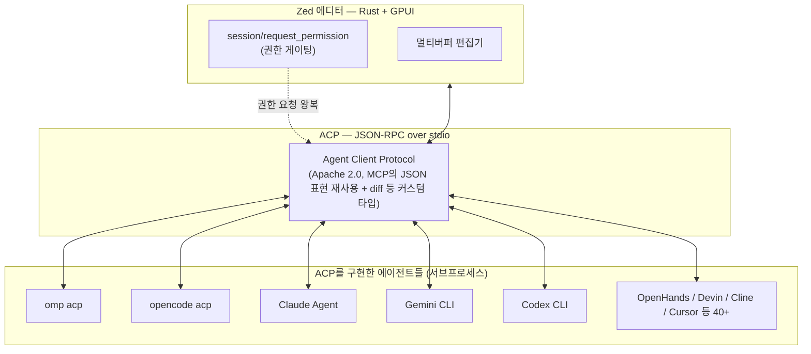

# Zed 에디터 & ACP 가이드

> [!question] 질문
> omp/OpenCode 문서에 "ACP 프로토콜로 Zed 등과 연결"이라는 말이 나오는데, 이 Zed가 뭔지, ACP가 뭔지 조사해서 정리해달라.

## TL;DR

Zed는 Atom·Tree-sitter·Electron을 만들었던 팀(Nathan Sobo, Antonio Scandurra, Max Brunsfeld)이 Rust로 처음부터 새로 짠 코드 에디터입니다. 자체 GPU 렌더링 UI 프레임워크(GPUI)로 빠른 반응성을 노리고, 실시간 협업과 AI 에이전트 통합에 특히 무게를 둡니다.

핵심은 **ACP(Agent Client Protocol)** — Zed가 만든 개방 표준으로, omp나 OpenCode 같은 터미널 에이전트가 "Zed 등과 연결"된다고 할 때의 그 연결 방식입니다. omp/OpenCode의 "ACP 서버 모드"는 바로 이 프로토콜을 구현한 것입니다.

조사 시점 기준 이 환경에는 Zed가 설치되어 있지 않습니다(`zed` 명령 없음).

## 1. 정체

| 항목 | 내용 |
|---|---|
| 이름 | Zed |
| 개발사 | Zed Industries |
| 창립자 | Nathan Sobo, Antonio Scandurra, Max Brunsfeld — Atom, Electron, Tree-sitter를 만든 팀 |
| 저장소 | GitHub `zed-industries/zed`, 약 8.68만 스타 |
| 라이선스 | GPL-3.0-or-later(주요), 일부 컴포넌트는 Apache-2.0 |
| 언어 스택 | Rust 97.3% |
| UI 프레임워크 | GPUI — Zed가 직접 만든 GPU 가속 네이티브 UI 프레임워크 |
| 지원 플랫폼 | macOS, Linux, Windows (웹 버전은 개발 중) |
| 가격 | 코어 기능은 무료/오픈소스, 비즈니스 플랜 별도 |
| 캐치프레이즈 | "Code at the speed of thought" / "Your last, next editor" |

## 2. 아키텍처 — 에디터와 에이전트가 분리된 구조

Zed 자체는 Rust로 짠 네이티브 에디터이고, AI 에이전트는 Zed 안에 내장된 게 아니라 **ACP라는 프로토콜로 외부 프로세스와 통신**하는 방식입니다. 그래서 omp든 OpenCode든 Claude Code든, ACP를 구현하기만 하면 Zed에 "꽂아" 쓸 수 있습니다.



## 3. 핵심 기능

### 에디터 코어
- 원격 개발 — UI는 로컬, 코드베이스는 원격 서버에서 실행
- 멀티버퍼 편집 — 코드베이스 곳곳의 조각을 한 화면에 모아 편집
- Vim 모드 1급 지원(텍스트 객체, 마크 포함)
- LSP 완전 통합, 아웃라인 뷰, 무지개 괄호, 구문 인식 선택, 인라인 힌트
- 내장 REPL(Jupyter 커널 연동)
- DAP 기반 네이티브 디버거(다중 언어)
- Git 1급 통합(스테이징·커밋·push/pull·diff), 프로젝트 전역 진단 멀티버퍼
- Dev Containers, CLI 지원

### AI/에이전트 기능
- **에이전틱 편집**: 에이전트에게 작업을 위임하고 진행 상황을 실시간으로 보며 변경을 리뷰
- **에디트 예측**: 자체 개방형 가중치 모델 "Zeta2"로 다음 입력 예측
- **인라인 어시스턴트**: 선택한 코드를 모델에 보내 바로 변환
- **다중 에이전트 지원**: Claude Agent, Codex, OpenCode 등 ACP 호환 에이전트를 자유롭게 선택
- **MCP 서버 연결**: 에이전트가 쓸 수 있는 지식/도구를 MCP로 확장
- **병렬 에이전트**: 여러 프로젝트에서 동시에 여러 에이전트 스레드 실행

### 협업
팀원과 채팅, 함께 코딩(멀티플레이어 편집), 화면·프로젝트 공유

## 4. ACP(Agent Client Protocol) 딥다이브

### 정의
ACP는 **Zed가 만들어 Apache-2.0으로 공개한 개방 표준**입니다. "어떤 에이전트든 어떤 에디터든" 서로 매끄럽게 붙을 수 있게 하는 게 목적입니다.

### 통신 방식
- 로컬 에이전트: 에디터가 에이전트를 **서브프로세스로 실행**하고 **JSON-RPC over stdio**로 통신
- 원격 에이전트: HTTP/WebSocket 지원이 진행 중
- 도구 호출 권한은 `session/request_permission`을 거쳐 에디터가 게이팅
- MCP와의 관계: 가능한 한 MCP의 JSON 표현을 재사용하되, diff 표시처럼 코딩 UX에 필요한 커스텀 타입을 추가

### 지원 생태계
- **에이전트 쪽**(40개 이상): omp, OpenCode, Claude Agent, Gemini CLI(첫 파트너, 2025-08-27), Claude Code(2025-09-03), Codex CLI(2025-10-16), GitHub Copilot, OpenHands, Devin, Cline, Cursor, Amp, Augment Code 등
- **에디터 쪽**: Zed 외에 JetBrains IDE군(2025-10-06 파트너십 발표), VS Code, Neovim, Emacs, Obsidian, 웹 브라우저(AI SDK 경유)도 ACP 클라이언트가 될 수 있음
- **프라이버시**: 서드파티 에이전트를 붙여도 코드가 Zed 서버에 저장되거나 학습에 쓰이지 않는다고 명시

## 5. omp / OpenCode를 Zed에 붙이는 법

```bash
omp acp        # omp를 ACP 서버로 띄우는 커맨드 (Zed가 서브프로세스로 실행)
opencode acp   # OpenCode를 ACP 서버로 띄우는 커맨드
```

Zed 쪽에서는 에이전트 패널 설정에서 "External Agent"로 위 실행 파일 경로를 등록하면, 터미널에서 쓰던 것과 동일한 에이전트가 Zed의 버퍼를 읽고, Zed의 저장 경로로 쓰고, 권한 요청은 Zed의 승인 UI를 거치게 됩니다.

## 6. ACP는 언제 쓰는가 (실전 예시)

- **에디터에서 보고 있는 버퍼를 그대로 컨텍스트로 주고 싶을 때** — 열려 있는 파일·커서 위치를 에이전트가 자동 인식, 코드를 복사해 붙여넣을 필요 없음
- **수정 결과를 diff로 눈으로 보고 승인/거부하고 싶을 때** — Zed의 네이티브 diff UI로 훅 단위 Accept/Reject
- **도구 호출 승인을 에디터 쪽에서 통일해서 관리하고 싶을 때** — 에이전트마다 제각각인 CLI 승인 방식 대신 항상 같은 승인 팝업
- **여러 에이전트를 갈아타면서 같은 에디터 UI로 쓰고 싶을 때** — omp ↔ Gemini CLI 등 도구를 안 바꾸고 "External Agent" 선택만 변경
- **Zed가 아니라 다른 에디터를 주력으로 쓰는데 omp/opencode 엔진이 더 좋을 때** — JetBrains·VS Code·Neovim·Emacs에서도 클라이언트가 될 수 있음

반대로, 혼자 터미널에서 빠르게 한두 개 명령만 시킬 때는 ACP를 쓸 이유가 없다 — `omp "이 버그 고쳐줘"`처럼 CLI로 바로 치는 게 더 간단하다. ACP는 "에디터 화면 안에서 지속적으로, 시각적으로, 여러 에이전트를 갈아 끼우며 작업"할 때 의미가 생긴다.

## 7. 이 환경에서 확인된 로컬 상태

- `zed` 명령이 PATH에 없어 로컬에 설치되어 있지 않음
- 설치하려면 공식 홈페이지(https://zed.dev/download)에서 OS별 설치 파일을 받거나, 각 OS 패키지 매니저를 이용(Windows 공식 지원 플랫폼 포함)

## 참고 자료

- [Zed — 공식 홈페이지](https://zed.dev/)
- [Zed — Agent Client Protocol 소개](https://zed.dev/acp)
- [Agent Client Protocol — 공식 문서](https://agentclientprotocol.com/overview/introduction)
- [GitHub: zed-industries/zed](https://github.com/zed-industries/zed)
- [Zed — External Agents 문서](https://zed.dev/docs/ai/external-agents)
