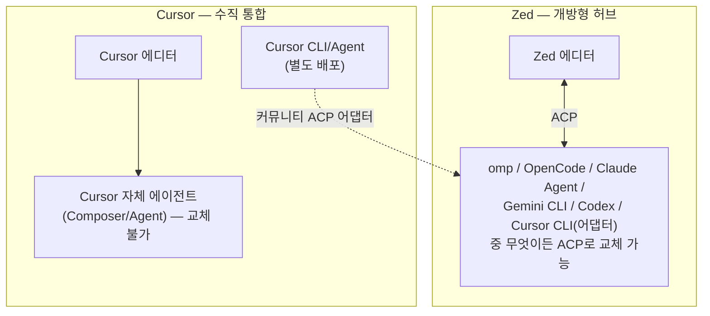

# Zed vs Cursor — 유사점과 차이점

> [!question] 질문
> Zed가 Cursor랑 비슷한 도구인가? 유사점과 차이점을 정리해달라.

## TL;DR

**네, 같은 카테고리의 경쟁 제품 맞습니다.** 둘 다 "AI가 처음부터 깊이 박힌 코드 에디터"입니다. 다만 만든 방식과 철학이 정반대에 가깝습니다.

- **Zed**: Rust로 처음부터 새로 짠 오픈소스 에디터. 에이전트는 내장하지 않고 ACP라는 개방 프로토콜로 외부 에이전트(omp, OpenCode, Claude Agent 등)를 갈아 끼우는 "허브"에 가깝습니다.
- **Cursor**: VS Code를 포크해 AI를 에디터 코어에 깊이 박아 넣은 비공개 상용 제품(Anysphere 개발). 자체 에이전트가 핵심이고, 다른 에이전트를 갈아 끼우는 구조가 아닙니다.

흥미로운 점은, Zed의 ACP 생태계 목록에 **"Cursor"가 에이전트로도 등록되어 있다**는 겁니다. 이건 Cursor 에디터 자체가 아니라, Cursor가 별도로 배포하는 "Cursor CLI/Agent"를 커뮤니티가 ACP 어댑터로 감싸 Zed에 꽂을 수 있게 만든 것입니다. 즉 두 제품의 ACP에 대한 태도 자체가 이 둘의 철학 차이를 그대로 보여줍니다.

## 1. Cursor 정체

| 항목 | 내용 |
|---|---|
| 이름 | Cursor |
| 개발사 | Anysphere, Inc. |
| 기반 | VS Code 포크 — AI를 익스텐션이 아니라 에디터 코어 런타임에 직접 통합 |
| 라이선스 | 비공개(closed source), 상용 제품 |
| 최근 변화 | Cursor 3(2026)에서 "파일 편집" 중심 UI를 "병렬 에이전트 관리" 중심 UI로 전환. Agents Window는 VS Code 포크가 아니라 처음부터 새로 만든 부분 |
| 투자 규모 | 2025-06 시리즈C $9억(밸류 $99억), 2025-11 시리즈D $23억(밸류 $293억) |
| 기업 고객 | Fortune 500의 절반 이상, SOC 2 인증, 엔터프라이즈 플랜 |

## 2. 유사점

- 둘 다 "AI 코딩 에이전트가 에디터 안에 산다"는 컨셉 — 별도 터미널 창을 안 띄워도 됨
- 둘 다 **에이전틱 편집**을 1급 기능으로 지원: 작업을 통째로 위임하고 진행 상황을 실시간으로 지켜보는 방식
- 둘 다 **병렬 에이전트** 실행 지원 (여러 작업을 동시에 여러 에이전트에게)
- 둘 다 **MCP(Model Context Protocol)** 지원 — 외부 도구·데이터 연결
- 둘 다 **다중 모델 선택** 지원 (Anthropic/OpenAI/Google 등 여러 프로바이더)
- 둘 다 **클라우드/백그라운드 에이전트**로 원격 머신에서 작업 실행 가능
- 둘 다 Git 통합, 자체 코드 예측/자동완성 모델 보유(Zed의 Zeta2, Cursor의 Composer/Tab)

## 3. 차이점

| 항목 | Zed | Cursor |
|---|---|---|
| 소스 공개 | 오픈소스(GPL-3.0-or-later + 일부 Apache-2.0) | 비공개 상용 |
| 엔진 기반 | Rust로 처음부터 새로 작성, 자체 GPUI 프레임워크 | VS Code 포크(Electron 기반), 일부는 새로 작성 중(Cursor 3 Agents Window) |
| 에이전트 구조 | 에디터에 에이전트를 내장하지 않음 — ACP로 외부 에이전트를 꽂아 씀 | 자체 에이전트(Composer/Agent)가 핵심, Anysphere가 직접 만들고 통제 |
| 외부 에이전트 교체 | 자유(omp, OpenCode, Claude Agent, Gemini CLI, Codex 등 40개 이상 중 선택) | 기본적으로 불가 — Cursor 자체 에이전트 사용이 기본 경로 |
| ACP에 대한 입장 | ACP를 직접 만든 원조, "어떤 에이전트든 오라"는 개방 허브 전략 | 공식 지원 아님. 커뮤니티가 "Cursor CLI"를 ACP 어댑터로 감싸 Zed 등에 꽂을 수 있게 만든 것(비공식) |
| 회사 성격 | 상대적으로 작은 팀, 오픈소스 커뮤니티 중심 | 대규모 투자(수십억 달러 밸류), 엔터프라이즈·Fortune 500 영업 중심 |
| 협업 기능 | 실시간 멀티플레이어 편집·채팅·화면공유가 코어 기능 | Slack 연동, PR 리뷰 등 팀 워크플로 통합에 집중 |
| 모바일/부가 앱 | 없음 | iOS 앱(2026-06 출시), Mission Control(윈도우 관리), Design Mode |
| 가격 | 코어 기능 무료, 비즈니스 플랜 별도 | 유료 구독 중심(Hobby/Pro/Business 등급), 엔터프라이즈 별도 |

## 4. ACP를 대하는 태도가 갈리는 지점

Zed는 "에디터는 하나, 에이전트는 자유"를 지향하고, Cursor는 "에디터와 에이전트를 통째로 수직 통합"하는 쪽입니다. 다만 Cursor가 별도로 내놓는 헤드리스 "Cursor CLI/Agent"는 커뮤니티 어댑터를 통해 Zed 같은 ACP 허브에도 손님으로 들어갈 수 있습니다 — 반대 방향(Zed를 Cursor 안에 꽂는 것)은 존재하지 않습니다.

## 5. 언제 뭘 쓸까

- **Zed가 맞는 경우**: 특정 에이전트에 종속되고 싶지 않을 때, omp·OpenCode처럼 이미 써본 터미널 에이전트를 에디터 화면에서 그대로 쓰고 싶을 때, 오픈소스·가벼운 네이티브 성능을 중시할 때, 실시간 협업이 중요할 때
- **Cursor가 맞는 경우**: 에이전트 자체의 완성도(자동완성 Tab, Composer 품질)와 엔터프라이즈 지원·통합(Slack, PR 리뷰, 팀 마켓플레이스)을 더 중시할 때, VS Code 확장 생태계와의 호환성이 필요할 때

## 참고 자료

- [Zed — Agent Client Protocol](https://zed.dev/acp)
- [Zed ACP 레지스트리: Cursor(에이전트)](https://zed.dev/acp/agent/cursor)
- [Cursor — 공식 홈페이지](https://cursor.com/)
- [Cursor 3 관련 분석 — InfoQ](https://www.infoq.com/news/2026/04/cursor-3-agent-first-interface/)
- [GitHub: raphaelluethy/cursor-acp](https://github.com/raphaelluethy/cursor-acp)
- [GitHub: konsumer/cursor-agent-acp](https://github.com/konsumer/cursor-agent-acp)
