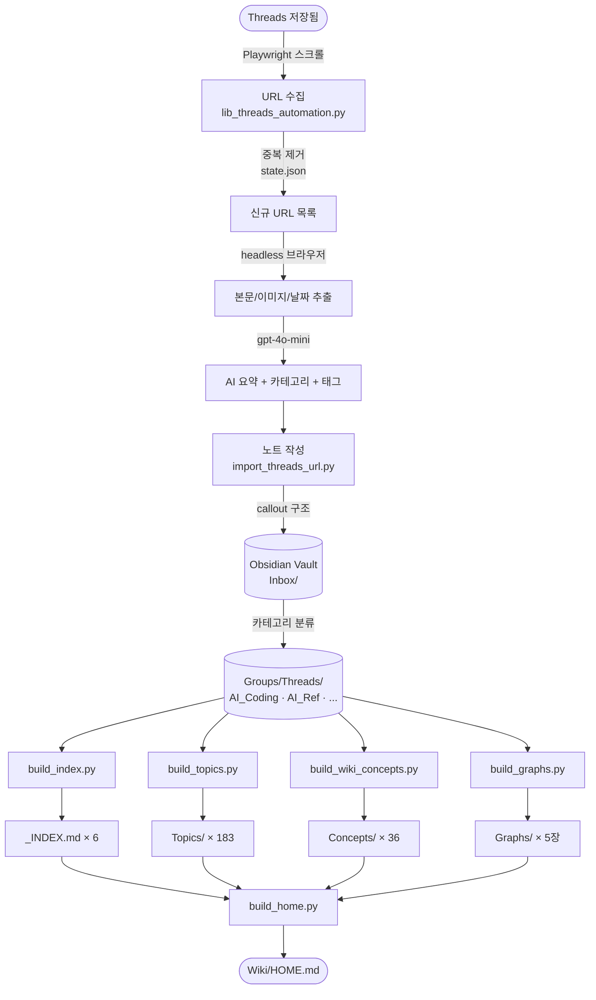

# ThreadsToObsidian — 전체 시스템 구조도
> 작성일: 2026-04-07

---

## 1. 전체 흐름 개요

```
Threads 저장됨
     │
     ▼
[수집] super_sync.py
     │  Playwright headless 브라우저
     │  저장됨 페이지 스크롤 수집
     │
     ▼
[추출] lib_threads_automation.py
     │  본문 · 이미지 · 날짜 추출
     │
     ▼
[AI 처리] lib_llm.py
     │  요약 · 카테고리 · 태그 생성
     │  (OpenAI gpt-4o-mini / Gemini)
     │
     ▼
[저장] import_threads_url.py
     │  Obsidian 노트 작성 (callout 구조)
     │  이미지 로컬 다운로드
     │  state.json 업데이트 (중복 방지)
     │
     ▼
[분류] categorize_notes.py
     │  카테고리별 폴더 이동
     │  (AI_Coding / AI_Ref / Business / Daily / General_Ref)
     │
     ▼
[위키 빌드] ──────────────────────────────────────
     │
     ├── build_index.py     → 카테고리별 _INDEX.md
     ├── build_topics.py    → Wiki/Topics/ (183개 태그 클러스터)
     ├── build_wiki_concepts.py → Wiki/Concepts/ (36개 개념 페이지)
     ├── build_graphs.py    → Wiki/Graphs/ (통계 차트 5종)
     └── build_home.py      → Wiki/HOME.md (마스터 진입점)
```

---

## 2. 데이터 흐름 상세



---

## 3. Obsidian Vault 폴더 구조

```
D:\Obsidian\
│
├── Groups\
│   └── Threads\
│       ├── Inbox\               ← 임포트 직후 임시 보관
│       │   └── Attachments\     ← 이미지 임시
│       ├── AI_Coding\           ← 195개 노트 (AI 코딩)
│       │   ├── _INDEX.md        ← Phase 1 자동 생성
│       │   └── Attachments\
│       ├── AI_Ref\              ← 176개 노트 (AI 참고)
│       ├── Business\            ← 37개 노트
│       ├── Daily\               ← 24개 노트
│       ├── General_Ref\         ← 66개 노트
│       └── Uncategorized\       ← 11개 노트
│
└── Wiki\                        ← 지식 베이스 (신규)
    ├── HOME.md                  ← 마스터 진입점 (Phase 5)
    ├── Concepts\                ← 36개 개념 페이지 (Phase 3)
    │   ├── Claude-Code.md
    │   ├── MCP.md
    │   ├── LLM.md
    │   └── ...
    ├── Topics\                  ← 183개 태그 클러스터 (Phase 2)
    │   ├── Claude-Code.md
    │   ├── AI-에이전트.md
    │   └── ...
    └── Graphs\                  ← 통계 시각화 (Phase 6)
        ├── STATS.md
        ├── tag_frequency.png
        ├── import_timeline.png
        ├── category_pie.png
        ├── author_ranking.png
        └── topic_network.png
```

---

## 4. 핵심 스크립트 역할

| 스크립트 | 역할 | 실행 방식 |
|----------|------|-----------|
| `super_sync.py` | 전체 파이프라인 오케스트레이터 | `/threads-import` 실행 |
| `lib_threads_automation.py` | Playwright 브라우저 제어 (수집/추출) | super_sync 내부 |
| `import_threads_url.py` | 단건 URL 임포트 + 노트 작성 | `--url` 옵션 |
| `lib_llm.py` | OpenAI / Gemini LLM 추상화 레이어 | super_sync 내부 |
| `lib_state.py` | state.json 읽기/쓰기 (중복 방지) | import 내부 |
| `categorize_notes.py` | 카테고리별 폴더 분류 + 이미지 이동 | super_sync 내부 |
| `build_index.py` | 카테고리별 `_INDEX.md` 생성 | super_sync 자동 |
| `build_topics.py` | 태그 기반 토픽 클러스터 페이지 | super_sync 자동 |
| `build_wiki_concepts.py` | 개념 위키 페이지 (무료, 기존 요약 재활용) | super_sync 자동 |
| `build_home.py` | `Wiki/HOME.md` 마스터 홈 | super_sync 자동 |
| `build_graphs.py` | matplotlib 통계 차트 5종 | 수동 실행 |
| `reformat_notes.py` | 노트 callout 구조 리포맷 (1회성) | 수동 실행 |
| `add_aliases.py` | 그래프 뷰용 alias 추가 | 수동 실행 |

---

## 5. 노트 구조 (현재 포맷)

```markdown
---                                    ← frontmatter
source: threads_url
threads_url_item_id: abc123
category: "AI 참고"
tags: ["LLM", "AI", "위키"]
aliases: ["요약 첫 문장 40자…"]        ← 그래프 뷰 표시 이름
author_handle: "choi.openai"
url: "https://www.threads.com/..."
imported_at: 2026-04-07T13:23:45+09:00
---

> [!abstract] @choi.openai · 2026-04-07 · AI 참고   ← callout
> `#LLM` `#AI` `#위키`
>
> AI 요약 전문 (3~4문장)
>
> [🔗 원문](https://www.threads.com/...)

## 본문

Threads 원문 전체

---
![[이미지1.jpg]]
![[이미지2.jpg]]
```

---

## 6. super_sync.py 실행 순서

```
① URL 수집         lib_threads_automation.collect_saved_urls()
                   └─ 저장됨 페이지 스크롤 (최대 80회, 5회 무변화 시 종료)

② 중복 제거        state.json 기반 신규 URL 필터링

③ 본문 추출 (loop) get_post_details_with_browser()
                   └─ domcontentloaded + 5초 대기 + DOM 파싱

④ AI 분석          llm.summarize_and_classify(text)
                   └─ 요약 / 카테고리 / 태그 / 날짜

⑤ 노트 저장        _write_url_note() → Inbox/notename.md
                   └─ 이미지 다운로드 → Attachments/

⑥ state 업데이트   mark_imported_items() → save_state()

⑦ 카테고리 분류    categorize_all_notes()
                   └─ Inbox → AI_Coding / AI_Ref / ...

⑧ 인덱스 갱신      build_all_indexes()     [Phase 1]
⑨ 토픽 갱신        build_all_topics()      [Phase 2]
⑩ 개념 페이지 갱신 build_all_concepts()    [Phase 3]
⑪ 홈 페이지 갱신   build_home()            [Phase 5]
```

---

## 7. 상태 관리 (state.json)

```
D:\Obsidian\_ops\threads_url_import\state\threads-url-import-state.json

{
  "imported_item_ids": [
    "abc123def456",   ← SHA1(url)[:12]
    ...               ← 509개
  ]
}
```
- 임포트 완료된 URL의 해시값 목록
- 다음 실행 시 이 목록에 있는 URL은 건너뜀
- `--force` 옵션으로 강제 재임포트 가능

---

## 8. 향후 계획 (보류)

| Phase | 내용 | 비용 |
|-------|------|------|
| 3-B | 개념 페이지 Agent Insight (LLM 분석) | 유료 |
| 6-B | 질문 → 관련 노트 검색 → Marp 슬라이드 생성 | 유료 |

---

## 9. 카파시 방식과 비교

| | Karpathy | 우리 시스템 |
|---|---|---|
| 자료 수집 | 수동 (raw/ 폴더) | ✅ 자동 (Threads 저장됨) |
| 위키 생성 | LLM이 새로 작성 | 기존 요약 재활용 (무료) |
| 업데이트 | 수동 실행 | ✅ 임포트마다 자동 |
| 질의응답 | ✅ 슬라이드/그래프 출력 | 추후 Phase 6-B |
| 비용 | LLM 호출 많음 | ✅ 거의 무료 |
